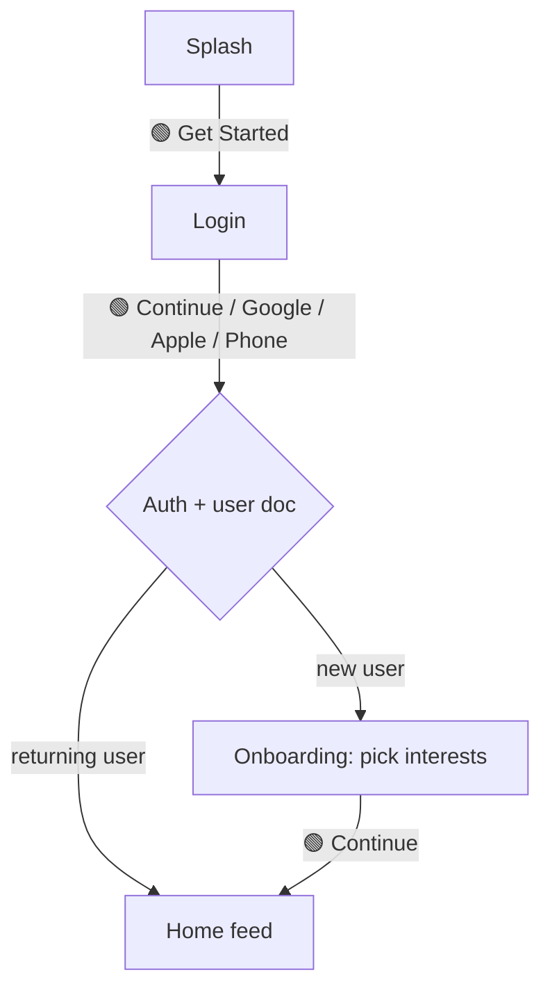
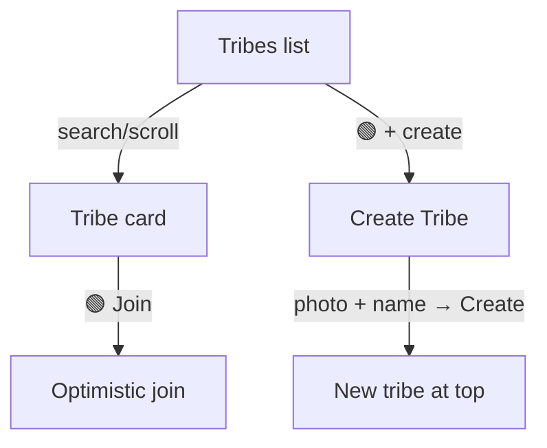
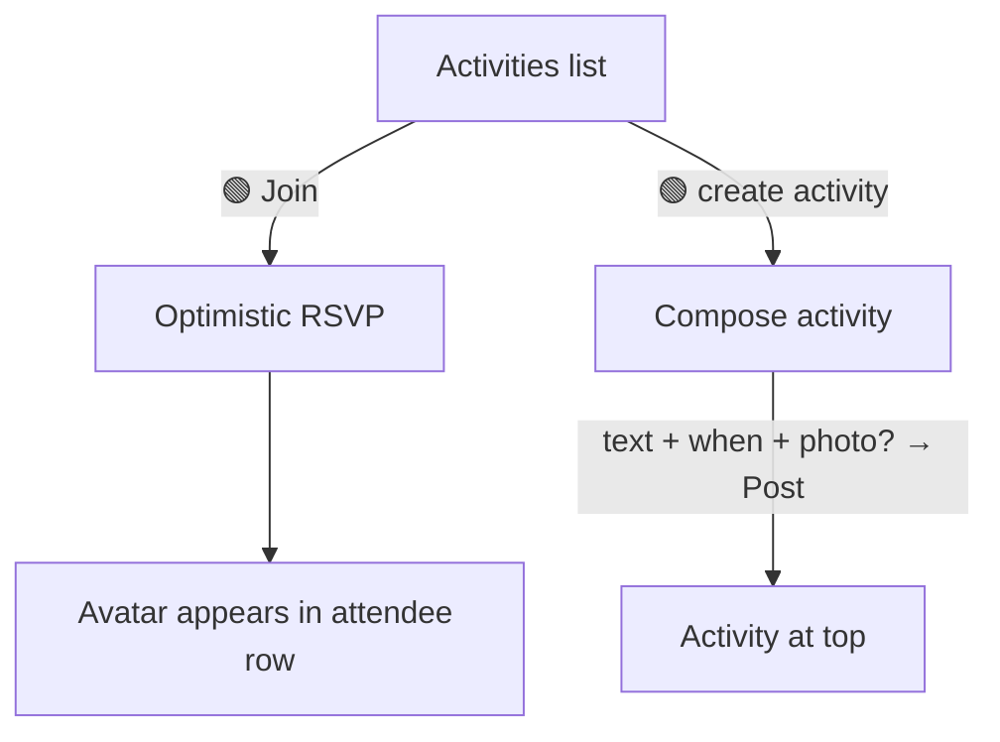
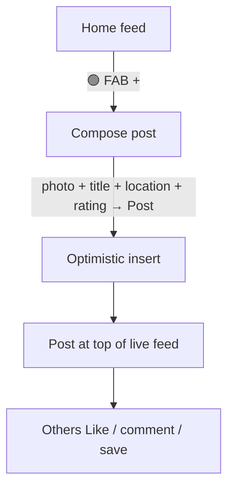
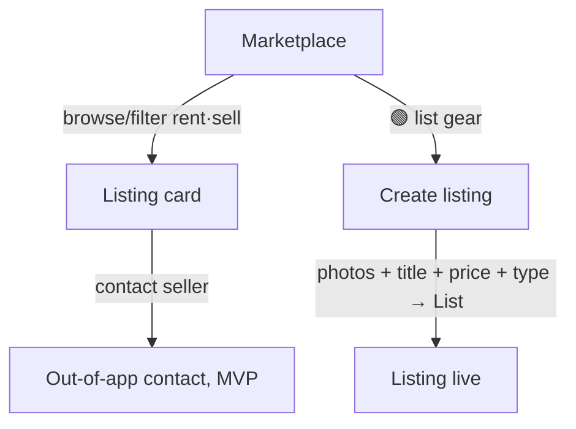
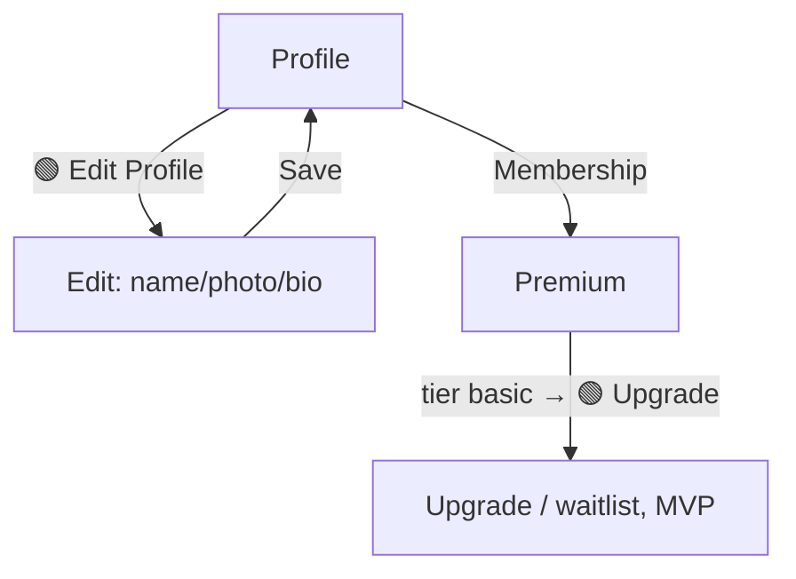

# ROAMR — UX Flow Map

Status: **spec only** — no application code. Companion to `BACKEND-PLAN.md`
(data model in §2, Storage in §3, Auth in §4, polish rules in §8).

This maps the core user journeys: the screen-by-screen steps, the **one primary
action** per screen, where **delight moments** live, the **empty / loading /
error** states, and the exact **backend reads/writes** that fire at each step.

Legend: 🟢 primary action · ✨ delight moment · 🔵 backend read · 🟠 backend write
· ⏳ loading state · 📭 empty state · ⚠️ error state.

---

## North-star patterns, translated

Look-and-feel inspiration only — no proprietary content copied.

| App | What feels premium-yet-simple | ROAMR translation |
|---|---|---|
| **AllTrails** | Rich discovery cards; one-tap **Save** to personal lists | Tribe/post/listing cards + `users/{uid}/saves` |
| **Strava** | Social feed where lightweight **kudos** + comments carry it | `posts` feed; optimistic Like (kudos), `comments` |
| **Meetup** | **RSVP** to events, **join** groups, "you're going" clarity | `activities` + `attendees`; `tribes` + `members` |
| **onX Maps** | Honest **premium gating** — free core, calm upsell | `users/{uid}.subscription` flag gates premium UI |

> ROAMR has **no maps, GPS, or trail database** today. Patterns needing those
> (live maps, route recording, "near me") are flagged per-journey under
> **Future enhancements** and collected in `BACKEND-PLAN.md` §8.7.

---

## Journey (a) — Sign in → Onboarding → First feed

The make-or-break first 60 seconds. Goal: from launch to a *personal*, populated
feed with zero dead ends.

| Step | Screen | Primary / actions | Backend | States |
|---|---|---|---|---|
| 1 | Splash | 🟢 Get Started | none | — |
| 2 | Login | 🟢 Continue (Email/Pwd, Google, Apple, Phone) | 🟠 Firebase Auth sign-in; 🟠 `setDoc users/{uid}` merge (create if new) | ⏳ button spinner during provider flow · ⚠️ "couldn't sign in, try again" inline |
| 3 | Onboarding | 🟢 Continue (select ≥1 activity) | 🟠 `update users/{uid}.interests` | 🟢 disabled until ≥1 picked |
| 4 | Home feed | 🟢 create post (FAB) | 🔵 `onSnapshot posts` (limit 10–15), ordered by interest | ⏳ skeleton cards · 📭 "Your feed's quiet — follow people or post your first adventure" + CTA · ⚠️ retry banner |

- ✨ **Delight:** interests visibly shape the first feed (the choice *did*
  something — AllTrails/Strava-style relevance); smooth Splash→Login transition;
  haptic tick on successful sign-in.
- **Backend notes:** `merge` on first sign-in guarantees `users/{uid}` exists, so
  no screen ever hits a missing-doc blank (BACKEND-PLAN §4, §8.3). MVP feed
  ranking = client-side boost/filter of `posts` by `interests`.
- **Future enhancements (decision needed):** server-side ranked feed (Cloud
  Function); "near me" feed (needs geo + geohash).

---

## Journey (b) — Discover & join a Tribe

Meetup-style "join a group," AllTrails-style browse + save.

| Step | Screen | Primary / actions | Backend | States |
|---|---|---|---|---|
| 1 | Tribes | 🟢 Join (per card) / + create / search | 🔵 `onSnapshot tribes` (ordered `createdAt desc`) | ⏳ skeleton rows · 📭 "No tribes yet — start one" · ⚠️ retry |
| 2 | Join tap | 🟢 Join → Joined | 🟠 `setDoc tribes/{id}/members/{uid}`; 🟠 bump `memberCount` | optimistic flip; ⚠️ rollback + toast on fail |
| 3 | Create Tribe | 🟢 Create (name required; photo optional) | 🟠 upload → `tribes/{ts}-{file}` Storage; 🟠 `addDoc tribes` (+`ownerId`, `memberCount:1`, owner in `members`) | ⏳ "Creating…" button · ⚠️ inline error, stay on form |

- ✨ **Delight:** Join flips instantly with a haptic (§8.1); created tribe streams
  to the top of the live list on its own (`onSnapshot`) — real reward, not faked.
- **Backend notes:** membership is a presence doc keyed by `uid` → idempotent,
  easy rollback. `memberCount` denormalized so the card shows the number without
  loading the subcollection (§8.6). *Retrofit:* add `ownerId` + members
  subcollection (BACKEND-PLAN build step 4).
- **Future enhancements:** tribe detail screen (members, tribe feed, events);
  search currently client-side over the loaded page — server search later.

---

## Journey (c) — Create & join an Activity

Meetup-style RSVP: "I'm going," with a visible attendee row.

| Step | Screen | Primary / actions | Backend | States |
|---|---|---|---|---|
| 1 | Activities | 🟢 Join / create / search / Like / comment | 🔵 `onSnapshot activities` (limit + `createdAt desc`) | ⏳ skeletons · 📭 "Nothing planned — propose an adventure" + CTA · ⚠️ retry |
| 2 | Join (RSVP) | 🟢 Join → Joined | 🟠 `setDoc activities/{id}/attendees/{uid}` (with name/photo); 🟠 bump `attendeeCount` | optimistic; your avatar pops into the row; ⚠️ rollback on fail |
| 3 | Create activity | 🟢 Post | 🟠 optional photo → `activities/{uid}/…` Storage; 🟠 `addDoc activities` (`authorId`, `startsAt`, denormalized author) | ⏳ posting · ⚠️ inline error |
| 4 | Like / comment | Like (✨ kudos) / comment | 🟠 `setDoc .../likes/{uid}`; 🟠 `addDoc .../comments`; counters bump | optimistic Like; comment appends live |

- ✨ **Delight:** attendee avatars animate into the row on Join; Strava-style
  Like with haptic; "you're going" clarity (Meetup).
- **Backend notes:** attendees mirror the likes pattern — presence doc keyed by
  `uid`, denormalized `displayName`/`photoURL` so the avatar row renders with no
  extra `users` reads (§8.6).
- **Future enhancements:** activity detail + chat; calendar reminder / `.ics`;
  location/map of the meet point (needs maps); capacity limits.

---

## Journey (d) — Post an adventure to the feed

Strava-style "share what you did," AllTrails-style rich card.

| Step | Screen | Primary / actions | Backend | States |
|---|---|---|---|---|
| 1 | Home | 🟢 FAB → compose | 🔵 `onSnapshot posts` (paged) | ⏳ skeletons · 📭 first-run empty + "post your first adventure" · ⚠️ retry |
| 2 | Compose | 🟢 Post (photo + title; location/rating optional) | 🟠 photo → `posts/{uid}/…` Storage; 🟠 `addDoc posts` (denormalized author, `likeCount:0`, `commentCount:0`) | ⏳ upload progress · ⚠️ keep draft on error |
| 3 | In feed | Like (✨) / comment / 🟢 Save | 🟠 `likes/{uid}`, `comments`, `users/{uid}/saves/{postId}`; counters bump | all optimistic; ⚠️ rollback per action |
| 4 | Pull-to-refresh | refresh | 🔵 re-warm subscription / fetch newest page | ✨ spring animation |

- ✨ **Delight:** new post lands at the top instantly via `onSnapshot`; image
  fades in (`loading="lazy"`); Save tucks into the user's list (AllTrails).
- **Backend notes:** denormalized author fields avoid N+1 user lookups; client
  resizes images before Storage upload; counters keep the card cheap (§8.6).
- **Future enhancements:** edit/delete own post; share sheet; tag a tribe/
  activity; attach a recorded route (needs GPS).

---

## Journey (e) — Browse / list in the Marketplace

Currently "Coming soon." AllTrails-card browsing + a simple create flow.

| Step | Screen | Primary / actions | Backend | States |
|---|---|---|---|---|
| 1 | Marketplace | 🟢 List gear / browse / filter (rent vs sell) | 🔵 `onSnapshot listings` where `status == active` (paged) | ⏳ skeleton grid · 📭 "No gear listed yet — be the first" + CTA · ⚠️ retry |
| 2 | Create listing | 🟢 List (title, price, type, ≥1 photo) | 🟠 photos → `listings/{uid}/{listingId}/…` Storage; 🟠 `addDoc listings` (`sellerId`, `status:"active"`) | ⏳ multi-photo upload progress · ⚠️ inline error |
| 3 | Listing detail | contact seller / save | 🔵 read listing; 🟠 optional `saves` | — |
| 4 | Manage own | mark reserved/sold | 🟠 `update listings/{id}.status` | optimistic status chip |

- ✨ **Delight:** multi-photo carousel; price/type chips; status changes feel
  instant.
- **Backend notes:** mirrors `tribes` create pattern with multi-image upload;
  `status` filter keeps the grid clean.
- **Future enhancements (decision needed):** in-app messaging, payments/escrow,
  reviews/ratings of sellers, tribe-scoped listings (`tribeId` exists in model).
  MVP keeps transactions **out of app** (contact seller) — no payment handling.

---

## Journey (f) — Profile & Premium

onX-style honest premium gating; real signed-in identity.

| Step | Screen | Primary / actions | Backend | States |
|---|---|---|---|---|
| 1 | Profile | 🟢 Edit Profile / Membership / Settings / Help / About | 🔵 read `users/{uid}` | ⏳ skeleton header · ⚠️ retry (never hardcoded user) |
| 2 | Edit Profile | 🟢 Save | 🟠 avatar → `avatars/{uid}/…` Storage; 🟠 `update users/{uid}` (`displayName`, `photoURL`, `bio`, `updatedAt`) | ⏳ saving · ⚠️ inline error |
| 3 | Premium | 🟢 Upgrade (or join waitlist, MVP) | 🔵 read `users/{uid}.subscription` (tier/renews/amount) | shows real tier; "Manage on app store" note |
| 4 | Upgrade tap | confirm | MVP: no charge — set flag manually / waitlist | calm, honest — no nagging |

- ✨ **Delight:** avatar updates everywhere instantly (denormalized author fields
  refresh on new posts); premium gating is calm and honest (onX).
- **Backend notes:** Premium is a **manual `subscription` flag** on the user doc
  for MVP (BACKEND-PLAN §7) — no Stripe/IAP. Profile reads the same `users/{uid}`
  created at sign-in, so it's never the hardcoded "Susana Jones" again.
- **Future enhancements (decision needed):** real billing (store IAP via
  Capacitor, or Stripe); the concrete premium feature list behind the flag;
  account deletion / data export.

---

## Cross-cutting state checklist (every async screen)

Per BACKEND-PLAN §8.3 — no screen ships without all three:

1. ⏳ **Loading** — skeleton matching the final layout (cards/rows/grid), not a
   spinner-on-blank.
2. 📭 **Empty** — designed, friendly, with the screen's one primary CTA.
3. ⚠️ **Error** — non-blocking; optimistic actions roll back with a quiet toast;
   list loads show an inline retry. Never a raw error string.
